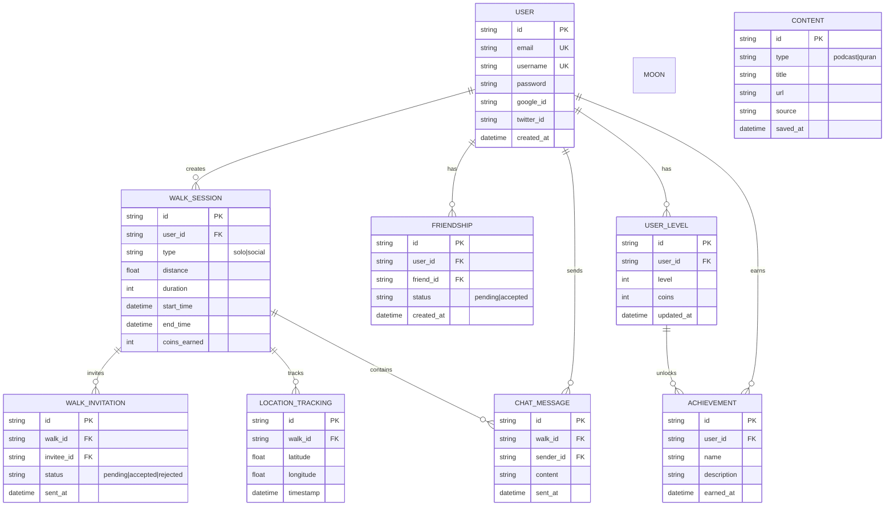

```mermaid
erDiagram
    USER ||--o{ WALK_SESSION : creates
    USER ||--o{ FRIENDSHIP : has
    USER ||--o{ USER_LEVEL : has
    USER ||--o{ ACHIEVEMENT : earns
    USER ||--o{ CHAT_MESSAGE : sends
    WALK_SESSION ||--o{ WALK_INVITATION : invites MOON
    WALK_SESSION ||--o{ CHAT_MESSAGE : contains
    WALK_SESSION ||--o{ LOCATION_TRACKING : tracks
    USER_LEVEL ||--o{ ACHIEVEMENT : unlocks

    USER {
        string id PK
        string email UK
        string username UK
        string password
        string google_id
        string twitter_id
        datetime created_at
    }

    WALK_SESSION {
        string id PK
        string user_id FK
        string type "solo|social"
        float distance
        int duration
        datetime start_time
        datetime end_time
        int coins_earned
    }

    FRIENDSHIP {
        string id PK
        string user_id FK
        string friend_id FK
        string status "pending|accepted"
        datetime created_at
    }

    USER_LEVEL {
        string id PK
        string user_id FK
        int level
        int coins
        datetime updated_at
    }

    ACHIEVEMENT {
        string id PK
        string user_id FK
        string name
        string description
        datetime earned_at
    }

    WALK_INVITATION {
        string id PK
        string walk_id FK
        string invitee_id FK
        string status "pending|accepted|rejected"
        datetime sent_at
    }

    CHAT_MESSAGE {
        string id PK
        string walk_id FK
        string sender_id FK
        string content
        datetime sent_at
    }

    LOCATION_TRACKING {
        string id PK
        string walk_id FK
        float latitude
        float longitude
        datetime timestamp
    }

    CONTENT {
        string id PK
        string type "podcast|quran"
        string title
        string url
        string source
        datetime saved_at
    }
```