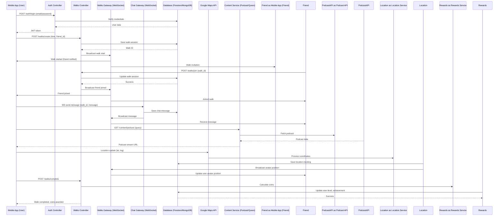

```mermaid
sequenceDiagram
    participant User as Mobile App (User)
    participant Auth as Auth Controller
    participant Walk as Walks Controller
    participant WS as Walks Gateway (WebSocket)
    participant Chat as Chat Gateway (WebSocket)
    participant DB as Database (Firestore/MongoDB)
    participant Maps as Google Maps API
    participant Content as Content Service (Podcast/Quran)

    User->>Auth: POST /auth/login (email/password)
    Auth->>DB: Verify credentials
    DB-->>Auth: User data
    Auth-->>User: JWT token

    User->>Walk: POST /walks/create (time, friend_id)
    Walk->>DB: Save walk-session
    DB-->>Walk: Walk ID
    Walk->>WS: Broadcast walk start
    WS->>User: Walk started (friend notified)
    WS->>Friend as Mobile App (Friend): Walk invitation

    Friend->>Walk: POST /walks/join (walk_id)
    Walk->>DB: Update walk-session
    DB-->>Walk: Success
    Walk->>WS: Broadcast friend joined
    WS->>User: Friend joined
    WS->>Friend: Joined walk

    User->>Chat: WS send-message (walk_id, message)
    Chat->>DB: Save chat-message
    Chat->>WS: Broadcast message
    WS->>Friend: Receive message

    User->>Content: GET /content/podcast (query)
    Content->>PodcastAPI as Podcast API: Fetch podcast
    PodcastAPI-->>Content: Podcast data
    Content-->>User: Podcast stream URL

    User->>Maps: Location update (lat, lng)
    Maps->>Location as Location Service: Process coordinates
    Location->>DB: Save location-tracking
    Location->>WS: Broadcast avatar position
    WS->>Friend: Update user avatar position

    User->>Walk: POST /walks/complete
    Walk->>Rewards as Rewards Service: Calculate coins
    Rewards->>DB: Update user-level, achievement
    DB-->>Rewards: Success
    Walk-->>User: Walk completed, coins awarded
```