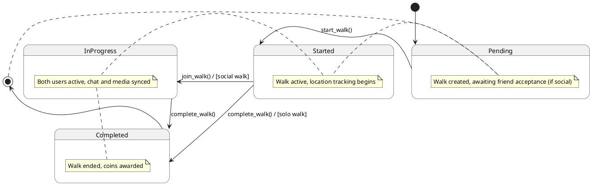

```plantuml
@startuml
[*] --> Pending
Pending --> Started : start_walk()
Started --> InProgress : join_walk() / [social walk]
Started --> Completed : complete_walk() / [solo walk]
InProgress --> Completed : complete_walk()
Completed --> [*]

state Pending {
  note right: Walk created, awaiting friend acceptance (if social)
}
state Started {
  note right: Walk active, location tracking begins
}
state InProgress {
  note right: Both users active, chat and media synced
}
state Completed {
  note right: Walk ended, coins awarded
}
@enduml
```